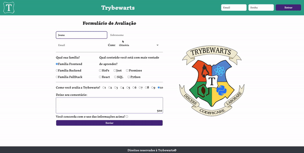

# Boas-vindas ao repositório do projeto Trybewarts Wizarding School! 🧙

Para realizar o projeto, atente-se a cada passo descrito a seguir, e se tiver qualquer dúvida, nos envie por _Slack_! #vqv 🚀

Aqui você vai encontrar os detalhes de como estruturar o desenvolvimento do seu projeto a partir deste repositório, utilizando uma branch específica e um _Pull Request_ para colocar seus códigos.

# Termos e acordos

Ao iniciar este projeto, você concorda com as diretrizes do Código de Conduta e do Manual da Pessoa Estudante da Trybe.

# Entregáveis

<details>
  <summary><strong>🤷🏽‍♀️ Como entregar</strong></summary><br />

Para entregar o seu projeto você deverá criar um _Pull Request_ neste repositório.

Lembre-se que você pode consultar nosso conteúdo sobre [Git & GitHub](https://app.betrybe.com/course/4d67f5b4-34a6-489f-a205-b6c7dc50fc16/) e nosso [Blog - Git & GitHub](https://blog.betrybe.com/tecnologia/git-e-github/) sempre que precisar!

</details>

<details>
  <summary><strong>🧑‍💻 O que deverá ser desenvolvido</strong></summary><br />

Neste projeto, você vai desenvolver uma página de formulário da Escola de Magia de Trybewarts, em que as pessoas estudantes poderão enviar seus feedbacks sobre ela. O tema desse projeto é baseado na obra 'Harry Potter', de J. K. Rowling, já que programar é o mais próximo que podemos chegar de algo **verdadeiramente mágico**! Mas não se preocupe se não tiver conhecimento sobre o universo da obra original, pois essa é uma versão própria da Escola de Bruxaria e você terá todas as informações necessárias para a construção do projeto nesse **README**!

</details>

<details>
  <summary><strong>🗓 Data de Entrega</strong></summary><br />

- Este projeto é em equipe
- Será `1` dia de projeto
- Data para entrega regular do projeto: `21/10/2022 14:00`

</details>

# Orientações

<details>
  <summary><strong>‼ Antes de começar a desenvolver</strong></summary><br />

⚠️ **Esse projeto tem um fluxo um pouco diferente dos outros. Os passos 1 a 7 devem ser feitos por uma pessoa da equipe (a que vai criar a branch de trabalho). As outras pessoas devem fazer apenas o passo 1 (clonar o projeto) e depois mudar para a branch criada pela primeira pessoa, utilizando o comando:**

```bash
git checkout joao-silva-trybewarts
```

⚠️ **Caso tenha feito o comando acima e não encontrou a branch, pode utilizar o comando para atualizar as branches no seu computador:**

```bash
git fetch
```

1. Clone o repositório

- `git clone git@github.com:tryber/sd-027-b-project-trybewarts.git`.
- Entre na pasta do repositório que você acabou de clonar:
  - `cd sd-027-b-project-trybewarts`

2. Instale as dependências e inicialize o projeto:

   - Para isso, use o seguinte comando: `npm install`

3. Crie uma branch a partir da branch `main`

- Verifique se você está na branch `main`:
  - Exemplo: `git branch`
- Se não estiver, mude para a branch `main`
  - Exemplo: `git checkout main`
- Agora, crie uma branch onde você vai guardar os `commits` do seu projeto:
  - Você deve criar uma branch no seguinte formato: `nome-sobrenome-nome-do-projeto`
  - Exemplo: `git checkout -b joao-silva-trybewarts`

4. Crie na raiz do projeto os arquivos que você precisará desenvolver:

- Verifique se você está na raiz do projeto

  - Exemplo: `pwd` -> o retorno vai ser algo como _/Users/joao/code/**sd-027-b-project-trybewarts**_

- Crie os arquivos `index.html`, `style.css` e `script.js`
  - Exemplo: `touch index.html style.css script.js`

5. Adicione as mudanças ao _stage_ do Git e faça um `commit`

- Verifique que as mudanças ainda não estão em _stage_

  - Exemplo: `git status` (devem aparecer listados os novos arquivos em vermelho)

- Adicione o novo arquivo ao _stage_ do Git

  - Exemplo:
    - `git add .` (adicionando todas as mudanças - _que estavam em vermelho_ - ao stage do Git)
    - `git status` (devem aparecer listados os arquivos em verde)

- Faça o `commit` inicial
  - Exemplo:
    - `git commit -m 'iniciando o projeto. VAMOS COM TUDO :rocket:'` (fazendo o primeiro commit)
    - `git status` (deve aparecer uma mensagem como _nothing to commit_ )

6. Adicione a sua branch com o novo `commit` ao repositório remoto

- Usando o exemplo anterior: `git push -u origin joao-silva-trybewarts`

7. Crie um novo `Pull Request` _(PR)_

- Vá até a página de _Pull Requests_ do [repositório no GitHub](https://github.com/tryber/sd-027-b-project-trybewarts/pulls)
- Clique no botão verde _"New pull request"_
- Clique na caixa de seleção _"Compare"_ e escolha a sua branch **com atenção**
- Coloque um título para a sua _Pull Request_
  - Exemplo: _"Cria tela de busca"_
- Clique no botão verde _"Create pull request"_
- Adicione uma descrição para o _Pull Request_ no seguinte formato: `[Joao Silva e Maria Souza] Trybewarts`, e clique no botão verde _"Create pull request"_
- **Não se preocupe em preencher mais nada por enquanto!**
- Volte até a [página de _Pull Requests_ do repositório](https://github.com/tryber/sd-027-b-project-trybewarts/pulls) e confira que o seu _Pull Request_ está criado

</details>

<details>
  <summary><strong>⌨️ Durante o desenvolvimento</strong></summary><br />

- Como o projeto é em grupo, você precisa garantir que o seu código está atualizado com as informações que estão no remoto, para isso, precisa rodar o seguinte comando:

```bash
git pull origin nome-da-branch
```

**Obs: Esse comando, atualiza no seu local apenas o código dessa branch.**

- Faça `commits` das alterações que você fizer no código regularmente;

- Lembre-se de sempre atualizar o repositório remoto após um (ou alguns) `commits`;

- Os comandos que você utilizará com mais frequência são:

  1. `git status` _(para verificar o que está em vermelho - fora do stage - e o que está em verde - no stage)_;

  2. `git add` _(para adicionar arquivos ao stage do Git)_;

  3. `git commit` _(para criar um commit com os arquivos que estão no stage do Git)_;

  4. `git push -u origin nome-da-branch` _(para enviar o commit para o repositório remoto na primeira vez que fizer o `push` de uma nova branch)_;

  5. `git push` _(para enviar o commit para o repositório remoto após o passo anterior)_.

</details>

<details>
  <summary><strong>🤝 Depois de terminar o desenvolvimento</strong></summary><br />

#### A pessoa dona da branch deve garantir que o último commit nessa branch é seu. Pode ser feita alguma alteração que não afete o cumprimento dos requisitos para realizar o commit.

As outras pessoas integrantes da equipe devem criar uma nova `branch` a partir da `branch` de trabalho _(a primeira branch criada pela equipe)_.

Exemplo:

1. Use `git branch` para ter certeza de que está na branch de trabalho;
2. Caso não esteja, use `git checkout joaozinho-trybewarts-project` para trocar de `branch`;
3. User `git checkout -b mariazinha-trybewarts-project` para criar uma nova branch a partir da branch anterior (`joaozinho-trybewarts-project`);

**Garanta que o último commit da branch é de autoria da pessoa dona de cada branch. Novamente pode ser feita alguma alteração que não afete o cumprimento dos requisitos para realizar o commit.**

1. Adicione sua branch com o novo `commit` ao repositório remoto

- Usando o exemplo anterior: `git push -u origin mariazinha-trybewarts-project`

2. Crie um novo `Pull Request` _(PR)_

- Vá até a página de _Pull Requests_ do [repositório no GitHub](https://github.com/tryber/sd-027-b-project-trybewarts/pulls)
- Clique no botão verde _"New pull request"_
- Clique na caixa de seleção _"Compare"_ e escolha a sua branch **com atenção**
- Coloque um título para a sua _Pull Request_
  - Exemplo: _"Cria tela de busca"_
- Clique no botão verde _"Create pull request"_
- Adicione uma descrição para o _Pull Request_ no seguinte formato: `[Joao Silva e Maria Souza] Trybewarts`, e clique no botão verde _"Create pull request"_
- **Não se preocupe em preencher mais nada por enquanto!**
- Volte até a [página de _Pull Requests_ do repositório](https://github.com/tryber/sd-027-b-project-trybewarts/pulls) e confira que o seu _Pull Request_ está criado

⚠️ **Para que o projeto seja avaliado, o último commit na branch deve ser da pessoa que criou a branch.**

## Code Review (opcional)

Para sinalizar que o seu projeto está pronto para o _“Code Review”_, faça o seguinte:

- Vá até a página **DO SEU** _Pull Request_, adicione a label de _“code-review”_ e marque seus colegas:

  - No menu à direita, clique no _link_ **“Labels”** e escolha a _label_ **code-review**;
  - No menu à direita, clique no _link_ **“Assignees”** e escolha **o seu usuário**;
  - No menu à direita, clique no _link_ **“Reviewers”** e digite `students`, selecione o time `tryber/students-sd-027-b`.

Caso tenha alguma dúvida, [aqui tem um video explicativo](https://vimeo.com/362189205).

⚠️ **Lembre-se que garantir que todas as _issues_ comentadas pelo Linter estão resolvidas!** ⚠️

</details>

<details>
 <summary><strong>🕵🏿 Revisando um pull request</strong></summary><br />

Use o conteúdo sobre [Code Review](https://app.betrybe.com/course/real-life-engineer/code-review) para te ajudar a revisar os _Pull Requests_.

</details>

<details>
  <summary><strong>🎛 Linter</strong></summary><br />

Usaremos o [ESLint](https://eslint.org/) para fazer a análise estática do seu código.

Para garantir a qualidade do código, vamos utilizar neste projeto os linters `ESLint` e `Stylelint`. Assim o código estará alinhado com as boas práticas de desenvolvimento, sendo mais legível e de fácil manutenção!

Para poder rodar o `ESLint` certifique-se de ter executado o comando `npm install` dentro do projeto.

Para rodá-los localmente no projeto, execute os comandos abaixo:

```bash
npm run lint
npm run lint:styles
```

Se a análise do `ESLint` encontrar problemas no seu código, tais problemas serão mostrados no seu terminal. Se não houver problema no seu código, nada será impresso no seu terminal.

Você pode também instalar o plugin do `ESLint` no `VSCode`. Para isso, basta fazer o download do [plugin `ESLint`](https://marketplace.visualstudio.com/items?itemName=dbaeumer.vscode-eslint) e instalá-lo.

Em caso de dúvidas, confira o material na plataforma sobre [ESLint e Stylelint](https://app.betrybe.com/course/real-life-engineer/eslint).

⚠️ **PULL REQUESTS COM ISSUES NO LINTER NÃO SERÃO AVALIADAS. ATENTE-SE PARA RESOLVÊ-LAS ANTES DE FINALIZAR O DESENVOLVIMENTO!** ⚠️

</details>

<details>
  <summary><strong>🛠 Testes</strong></summary><br />
  
Para que os testes sejam executados localmente, verifique se a versão do node na sua máquina é a `16`:

```bash
node -v
```

Caso a versão seja diferente, você pode utilizar o `nvm` para trocar de versão com o seguinte comando:

```bash
nvm use 16
```

Todos os requisitos do projeto serão testados **automaticamente** por meio do `Cypress`.

## Cypress

O Cypress é uma ferramenta de teste de front-end desenvolvida para a web.

Antes de utilizá-lo, certifique-se de ter executado o comando `npm install` dentro do projeto.

Você pode rodar o cypress localmente para verificar se seus requisitos estão passando, para isso execute o um dos seguintes comandos:

Para testar o projeto utilizando apenas o terminal, execute o comando abaixo:

```bash
npm test
```

Para executar os testes e vê-los rodando em uma janela de navegador:

```bash
npm run cypress:open
```

ou

```bash
npx cypress open
```

Após executar um dos dois comandos acima, será aberta uma janela de navegador e então basta clicar no nome do arquivo de teste que quiser executar (project.spec.js).

Você também pode assistir a [este](https://vimeo.com/539240375/a116a166b9) vídeo 😉🎙

## Observações técnicas

Alguns requisitos devem seguir um padrão pré-estabelecido para que os testes automáticos funcionem corretamente, leia-os atentamente e siga à risca o que for pedido. Em particular, **atente-se para os nomes de _ids_ que alguns elementos do seu projeto devem possuir**.

⚠️ **Alguns requisitos pedem para utilizar Flexbox. Tenha atenção no que é solicitado caso vá usar algum framework CSS para que os requisitos sejam atendidos.**

O não cumprimento de um requisito, total ou parcialmente, impactará em sua avaliação.

- Os requisitos do seu projeto são avaliados automaticamente, sendo utilizada a resolução de tela de `1366 x 768` (1366 pixels de largura por 768 pixels de altura).

- ⚠️ Logo, recomenda-se desenvolver seu projeto usando a mesma resolução, via instalação [deste plugin](https://chrome.google.com/webstore/detail/window-resizer/kkelicaakdanhinjdeammmilcgefonfh?hl=en) do `Chrome` para facilitar a configuração da resolução.

- Atente-se para o tamanho das imagens que você utilizará neste projeto. **Não utilize imagens com um tamanho maior que _500Kb_.**

- ⚠️ Utilize uma ferramenta [como esta](https://picresize.com/pt) para redimensionar as imagens.

- Caso a avaliação falhe com alguma mensagem de erro parecida com `[409:0326/130838.878602:FATAL:memory.cc(22)] Out of memory. size=4194304`, provavelmente as imagens que você está utilizando estão muito grandes. Tente redimensioná-las para um tamanho menor.

- Para verificar se a sua avaliação foi computada com sucesso, você pode verificar os **detalhes da execução do avaliador**.

- Na página do seu _Pull Request_, acima do "botão de merge", procure por _**"Evaluator job"**_ e clique no link _**"Details"**_;

- Na página que se abrirá, procure pela linha _**"Cypress evaluator step"**_ e clique nela;

- Analise os resultados a partir da mensagem _**"(Run Starting)"**_;

- Caso tenha dúvidas, consulte [este vídeo](https://vimeo.com/420861252);

- Você tem liberdade para adicionar novos comportamentos ao seu projeto, seja na forma de aperfeiçoamentos em requisitos propostos ou novas funcionalidades, **desde que tais comportamentos adicionais não conflitem com os requisitos propostos**.

- Em outras palavras, você pode fazer mais do que for pedido, mas nunca menos.

- Contudo, tenha em mente que **nada além do que for pedido nos requisitos será avaliado**. _Esta é uma oportunidade de você exercitar sua criatividade e experimentar com os conhecimentos adquiridos._

⚠️ **O avaliador automático não necessariamente avalia seu projeto na ordem em que os requisitos aparecem no readme. Isso acontece para deixar o processo de avaliação mais rápido. Então, não se assuste se isso acontecer, ok?**

</details>

<details>
  <summary><strong>🏪 Desenvolvimento </strong></summary><br />

Você vai desenvolver este projeto em **equipe** e é fundamental que siga as instruções do repositório.

Todos os requisitos tem como base a página a seguir, que representa um formulário de avaliação da **Escola de Magia de Trybewarts**. Use a imagem do site como base e respeite o posicionamento dos elementos, mas quanto às cores e elementos de design que não interfiram nesses aspectos sinta-se livre para deixar a sua criatividade fluir!


**Não é um requisito utilizar a mesma fonte**, mas a fonte diferente utilizada no exemplo acima é Inknut Antiqua acessível [nesse link do Google Fonts](https://fonts.google.com/specimen/Inknut+Antiqua).

</details>

<details>
  <summary><strong>🏗 Estrutura do projeto</strong></summary> <br />

O seu Pull Request deverá conter, obrigatoriamente, os arquivos `index.html`, `style.css` e `script.js`, que conterão seu código HTML, CSS e JavaScript, respectivamente.

As imagens pedidas no projeto estão dentro da pasta `/images`.

⚠️ É importante que seus arquivos tenham exatamente estes nomes!

Caso sinta a necessidade de adicionar outro arquivos além destes, sinta-se à vontade.

</details>

<details>

 <summary><strong>⚛️ Dica</strong></summary><br />

- Caso você faça o download de bibliotecas externas, utilize o diretório libs (a partir da raiz do projeto) para colocar os arquivos (_.css, _.js, etc...) baixados.

</details>

<details>
  <summary><strong>🗣 Nos dê feedbacks sobre o projeto!</strong></summary><br />
  Ao finalizar e submeter o projeto, não se esqueça de avaliar sua experiência preenchendo o formulário. **Leva menos de 3 minutos!**

Link: [Formulário de avaliação do projeto](https://be-trybe.typeform.com/to/ZTeR4IbH)

</details>

<details>
  <summary><strong>🗂 Compartilhe seu portfólio!</strong></summary><br />

Você sabia que o LinkedIn é a principal rede social profissional e compartilhar o seu aprendizado lá é muito importante para quem deseja construir uma carreira de sucesso? Compartilhe esse projeto no seu LinkedIn, marque o perfil da Trybe (@trybe) e mostre para a sua rede toda a sua evolução.

</details>

# Requisitos Obrigatórios

Não se esqueça de criar os arquivos `index.html`, `style.css` e `script.js`!

⚠️ Lembre-se que o seu projeto só será avaliado se estiver passando por **todos os _checks_** do **Linter**. Utilize o comando `npm run lint` no seu terminal para verificar os _checks_ do **Linter** 😉 ⚠️

## 1. Crie uma barra verde na parte superior da página.

<details>
  <summary>
    A barra deve possuir a classe <code>header</code>, ser um <code>flex container</code> e ter a cor de fundo <code>rgb(50, 167, 145)</code>
  </summary><br/>

**O que será testado:**

- O elemento deve possuir a classe `header`;
- O elemento deve possuir a propriedade CSS `display: flex`;
- O elemento deve possuir a propriedade CSS `background-color: rgb(50, 167, 145)`.

</details>

## 2. Adicione o logotipo da Trybewarts.

<details>
  <summary>
    O logotipo deve estar dentro do <code>header</code> e ser um elemento <code>img</code>
  </summary><br/>

  - Crie uma tag `img` dentro do elemento com a classe `header`:
  - Adicione a classe `trybewarts-header-logo`;
  - Adicione o atributo `src` com o valor `images/trybewarts-header-logo.svg`;

**O que será testado:**

- O elemento `img` deve possuir a classe `trybewarts-header-logo`;
- O elemento `img` deve possuir o atributo `src` apontando para `images/trybewarts-header-logo.svg`.

</details>

## 3. Acrescente um formulário de login no `header`.

<details>
  <summary>
    Crie um formulário de login com os inputs de <code>email</code>, <code>senha</code> e um botão para login. O formulário deve estar posicionado à direita da logo;
    O botão deve validar os dados inseridos no formulário de forma que um alerta seja disparado quando o email e a senha forem corretos, e outro alerta seja disparado quando os inputs email ou senha estiverem incorretos.
  </summary><br/>

  - Crie um formulário com a classe `trybewarts-login`;

  - Crie o input de **email** dentro do formulário:
    - Adicione o atributo `name` com o valor **email**;
    - Adicione o atributo `placeholder` com o valor **Email**;

  - Crie o input de **senha** dentro do formulário:
    - Adicione o atributo `name` com o valor **password**;
    - Adicione o atributo `placeholder` com o valor **Senha**;

  - Crie um botão com o texto **"Entrar"**;
    - Faça com que o formulário seja um **flex container**;
    - Faça com que o formulário fique à direita da logo;

  - Valide o formulário:
    - Ao preencher o formulário e clicar no botão, será validado que:
    - Caso o email seja **"tryber@teste.com"** e a senha seja **"123456"**, será emitido um alerta contendo o texto **"Olá, Tryber!"**;
    - Em todos os outro casos deverá ser emitido um alerta contendo o texto **"Email ou senha inválidos."**;

**De olho na dica 👀:** adicione a propriedade `flex` que faz os elementos terem o espaçamento máximo **entre eles** no **header**

**O que será testado:**

- O formulário deve possuir a `tag` `form` e classe `trybewarts-login`;
- O formulário possui a propriedade CSS `display: flex`;
- O formulário está à direita da logo;
- Um dos inputs deve possuir o atributo `name` com valor igual a **email** e o atributo `placeholder` com valor igual a **Email**;
- Um dos inputs deve possuir o atributo `name` com valor igual a **password** e o `placeholder` com valor igual a **Senha**;
- O botão deve possuir o texto `Entrar`;
- O botão de login deve disparar um `alert` com o texto `Email ou senha inválidos`, no caso de erro de preenchimento dos dados;
- O botão de login deve disparar um `alert` com o texto `Olá, Tryber!`, no caso de preenchimento correto dos dados.

</details>

## 4. Crie um título com o texto "Trybewarts" centralizado dentro do `Header`.

<details>
  <summary>
  Deve existir um elemento <code>h1</code> com o texto Trybewarts, posicionado no meio do cabeçalho. Será necessário criar três elementos filhos para diagramar o cabeçalho
  </summary><br/>

  - Crie a tag `h1` com o `id` igual a `trybewarts-header-title`;
  - O título `h1` deverá ter o texto **"Trybewarts"**;

  - O título deverá estar no meio da barra verde:
    - O header deve ter exatamente três elementos filhos;
    - O filho do meio deve ser o título;

**O que será testado:**

- O `h1` deve possuir `ID` igual a `trybewarts-header-title` e com o texto `Trybewarts`;
- O elemento com a classe `header` deve possuir exatos `3` elementos filhos;
- O filho do meio do elemento com a classe `header` deve ser o título `h1` com o texto `Trybewarts`.

</details>

## 5. Adicione um formulário no corpo da página.

<details>
  <summary>
  Crie um formulário dentro de uma tag <code>main</code>. Ambos, formulário e tag <code>main</code> devem ser <code>flex containers</code> e a largura do formulário deve ser de <code>675px</code>
  </summary><br/>

  - Crie um formulário com o `ID` igual a `evaluation-form`;
  - Insira o formulário dentro de uma tag `main`;
  - Faça com que o formulário seja um `flex container`;
  - Faça com que o `main`, seja um `flex container`;
  - Adicione uma largura de `675px` ao formulário.

**O que será testado:**

- O elemento `form` deve possuir o `ID` igual a `evaluation-form`;
- O elemento `form` deve estar dentro da tag `main`;
- O elemento `main` e o `form` deve possuir a propriedade CSS `display: flex`;
- O elemento `form` deve possuir a propriedade CSS `width: 675px`.

</details>

## 6. Faça com que a direção do formulário seja vertical.

<details>
  <summary>
    A direção dos itens do formulário com o <code>ID</code> igual a <code>evaluation-form</code> devem estar na vertical, em coluna.
 </summary><br/>

**O que será testado:**

- O elemento `evaluation-form` deve possuir a propriedade CSS `flex-direction: column`.

</details>

## 7. Adicione a logo da Trybewarts ao lado direito da página.

  <details>
  <summary>
  Crie um elemento com a tag <code>img</code> e modifique sua altura para <code>500px</code>
  </summary><br/>

- Crie um elemento `img` com o `ID` igual a `trybewarts-forms-logo`;
- Adicione o atributo `src` com o valor `images/trybewarts-colored.svg`;
- Adicione o estilo css `height` de `500px`;

**O que será testado:**

- O elemento `img` deve possuir o `ID` igual a `trybewarts-forms-logo`;
- O elemento `img` deve possuir o atributo `src` com o valor `images/trybewarts-colored.svg`;
- O elemento `img` deve possuir o estilo css `height` de `500px`.

</details>

## 8. Acrescente inputs de `nome, sobrenome` e `email` ao formulário.

<details>
  <summary>
    Dentro do formulário adicione os inputs de <code>nome</code>, <code>sobrenome</code> e <code>email</code>
  </summary> <br />

  - Crie um input com o `ID` igual a `input-name`:
    - Adicione o atributo `placeholder` com o valor `Nome`;

  - Crie um input com o `ID` igual a `input-lastname`:
    - Adicione o atributo `placeholder` com o valor `Sobrenome`;

  - Crie um input com o `ID` igual a `input-email`:
    - Adicione o atributo `placeholder` com o valor `Email`.

**O que será testado:**

- O input para nome deve possuir o `ID` igual a `input-name` e placeholder `Nome`;
- O input para sobrenome deve possuir o `ID` igual a `input-lastname` e placeholder `Sobrenome`;
- O input para email deve possuir o `ID` igual a `input-email` e placeholder `Email`.

</details>

## 9. Acrescente um `select` ao formulário.

<details>
  <summary>
    O formulário deve possuir um input tipo <code>select</code>, com as opções <code>Gitnória</code>, <code>Reactpuff</code>, <code>Corvinode</code> e <code>Pytherina</code>
  </summary> <br />

  - Crie um `select` com o `ID` igual a `house`;
  - Adicione ao `select`:
    - A opção `Gitnória` com o `ID` igual a `gitnoria-house` e o atributo `value` igual a `Gitnória`;
    - A opção `Reactpuff` com o `ID` igual a `reactpuff-house` e o atributo `value` igual a `Reactpuff`;
    - A opção `Corvinode` com o `ID` igual a `corvinode-house` e o atributo `value` igual a `Corvinode`;
    - A opção `Pytherina` com o `ID` igual a `pytherina-house` e o atributo `value` igual a `Pytherina`.

**O que será testado:**

- O `select` deve possuir `ID` igual a `house`;
- O `select` deve possuir 4 opções;
- Uma das opções deve possuir `text` e `value` igual a `Gitnória` e `ID` igual a `gitnoria-house`;
- Uma das opções deve possuir `text` e `value` igual a `Reactpuff` e `ID` igual a `reactpuff-house`;
- Uma das opções deve possuir `text` e `value` igual a `Corvinode` e `ID` igual a `corvinode-house`;
- Uma das opções deve possuir `text` e `value` igual a `Pytherina` e `ID` igual a `pytherina-house`;

</details>

## 10. Posicione os campos de `Nome` e `Sobrenome` lado a lado.

<details>
  <summary>
    Os campos de <code>Nome</code> e <code>Sobrenome</code> devem estar lado a lado, com o campo de <code>Sobrenome</code> à direita
  </summary> <br />

**O que será testado:**

- O campo de `Sobrenome` deve estar à direita do campo de `Nome`.

</details>

## 11. Posicione os campos de `Email` e `Casa` lado a lado.

<details>
  <summary>
    Os campos de <code>Email</code> e <code>Casa</code> devem estar lado a lado, com o campo de <code>Casa</code> à direita
  </summary> <br />

**O que será testado:**

- O campo de `Casa` deve estar à direita do campo de `Email`.

</details>

## 12. Adicione 3 inputs do tipo `radio` ao formulário.

<details>
  <summary>
    O formulário deve possuir um campo de entrada com 3 inputs, um abaixo do outro, do tipo <code>radio</code> para que a pessoa estudante escolha com qual família mais se identifica.
  </summary> <br />

- Crie uma `label` com o `ID` igual a `label-family` e acrescente o texto **"Qual sua família?"**;

- Adicione ao formulário os seguintes elementos:
  - um `input` do tipo `radio` com o atributo `name` igual a `family` e `value` igual a `Frontend`;
  - um `input` do tipo `radio` com o atributo `name` igual a `family` e `value` igual a `Backend`;
  - um `input` do tipo `radio` com o atributo `name` igual a `family` e `value` igual a `FullStack`;

- Posicione os `radio buttons` para ficar abaixo um do outro e na sequência: **Frontend**, **Backend** e **FullStack**;

- Posicione os radio buttons abaixo da `label`.

**O que será testado:**

- O elemento `label` com o `id` igual a `label-family` deve possuir o conteúdo de texto igual a `Qual sua família?`;
- O primeiro `input` deve possuir o tipo `radio` com o atributo `name` igual a `family` e `value` igual a `Frontend`;
- O segundo `input` deve possuir o tipo `radio` com o atributo `name` igual a `family` e `value` igual a `Backend`;
- O terceiro `input` deve possuir o tipo `radio` com o atributo `name` igual a `family` e `value` igual a `FullStack`;
- Os inputs do tipo `radio` devem estar um abaixo do outro na sequência `Frontend`, `Backend` e `FullStack`.
- Os inputs do tipo `radio` devem estar abaixo do texto da `label`

</details>

## 13. Crie inputs do tipo `checkbox`.

<details>
  <summary>
    Os campos de entrada do tipo <code>checkbox</code> devem conter seis opções: <code>Hofs, Jest, Promises, React, SQL, Python</code> com a classe <code>subject</code> estando abaixo de uma label com <code>ID</code> igual a <code>label-content</code> cujo texto é <code>Qual conteúdo você está com mais vontade de aprender?</code>
  </summary> <br />

- Crie um elemento com o `id` igual a `label-content` e acrescente o texto **"Qual conteúdo você está com mais vontade de aprender?"**;
- Crie um input do tipo `checkbox` com a classe `subject` e o `value` igual a `HoFs`;
- Crie um input do tipo `checkbox` com a classe `subject` o `value` igual a `Jest`;
- Crie um input do tipo `checkbox` com a classe `subject` o `value` igual a `Promises`;
- Crie um input do tipo `checkbox` com a classe `subject` o `value` igual a `React`;
- Crie um input do tipo `checkbox` com a classe `subject` o `value` igual a `SQL`;
- Crie um input do tipo `checkbox` com a classe `subject` o `value` igual a `Python`;
- Posicione as checkboxes abaixo da label.

**O que será testado:**

- O elemento `label` deve possuir o `ID` igual a `label-content` com conteúdo de texto igual a `Qual conteúdo você está com mais vontade de aprender?`;
- O primeiro `input` do tipo `checkbox` deve possuir a classe `subject` e o atributo `value` igual a `HoFs`;
- O segundo `input` do tipo `checkbox` deve possuir a classe `subject` e o atributo `value` igual a `Jest`;
- O terceiro `input` do tipo `checkbox` deve possuir a classe `subject` e o atributo `value` igual a `Promises`;
- O quarto `input` do tipo `checkbox` deve possuir a classe `subject` e o atributo `value` igual a `React`;
- O quinto `input` do tipo `checkbox` deve possuir a classe `subject` e o atributo `value` igual a `SQL`;
- O sexto `input` do tipo `checkbox` deve possuir a classe `subject` e o atributo `value` igual a `Python`;
- Os elementos `checkbox` então posicionados abaixo da label.

</details>

## 14. Crie um campo de avaliação.

<details>
  <summary>
    O campo deve possuir 10 inputs do tipo <code>radio</code> para avaliar de 1 a 10 o nível de satisfação com a Trybewarts. Estes inputs devem ficar abaixo de uma <code>label</code> com texto <code>Como você avalia a Trybewarts?</code> e devem estar posicionados lado a lado.
  </summary> <br />

  - Crie uma `label` com o `ID` igual a `label-rate` e acrescente o texto **"Como você avalia a Trybewarts?"**;

  - Crie 10 `radio buttons`, contendo as opções de 1 a 10:
    - Adicione o atributo `value` com o valor de 1 a 10;
    - Adicione ao atributo `name` dos `radio buttons` o valor `rate`;

  - Posicione os `radio buttons` de modo que fiquem lado a lado.

**O que será testado:**

- O elemento `label` deve possuir o `ID` igual a `label-rate` e o conteúdo de texto `Como você avalia a Trybewarts?`;
- Os 10 `radio-buttons` devem possuir o atributo `name` igual a `rate`;
- Os 10 `radio-buttons` devem possuir o atributo `value` de 1 a 10.
- Os 10 `radio-buttons` devem estar posicionados lado a lado.

</details>

## 15. Crie uma textarea.

<details>
  <summary>
    Crie uma <code>textarea</code> com número máximo de caracteres igual à 500 abaixo de um <code>label</code> com texto <code>Deixe seu comentário:</code>
  </summary> <br />

  - Crie uma `textarea`;
  - Crie uma label com a classe `textarea` e que possua o texto **"Deixe seu comentário:"**;
  - Adicione ao elemento `textarea` o limite de 500 caracteres.

**O que será testado:**

- O elemento `label` deve possuir a classe `textarea` e o texto `Deixe seu comentário:`;
- O elemento `textarea` deve possuir um limite de 500 caracteres.

</details>

## 16. Crie uma `checkbox` que servirá para validar as informações digitadas pela pessoa usuária.

<details>
  <summary>
     Adicione um campo de entrada do tipo <code>checkbox</code> ao lado direito de uma <code>label</code> com texto <code>"Você concorda com o uso das informações acima?"</code>
  </summary> <br />

  - Crie um campo de entrada do tipo `checkbox` com o `ID` igual a `agreement`;
  - Crie uma label com o `ID` igual a `label-infos` e que possua o texto **"Você concorda com o uso das informações acima?"**;
  - Posicione o `checkbox` ao lado da label.

**O que será testado:**

- O elemento label deve possuir o `ID` igual a `label-infos` e texto igual a `Você concorda com o uso das informações acima?`;
- O input deve ser do tipo `checkbox` com `ID` igual a `agreement`.

</details>

## 17. Crie um botão de "Enviar" para submeter o formulário.

<details>
  <summary>
    Crie um botão  do tipo <code>submit</code> com o texto <code>Enviar</code> para submeter o formulário.</code>
  </summary> <br />

  - Crie um botão do tipo `submit` com o `ID` igual a `submit-btn`;
  - Adicione o texto **"Enviar"** ao botão.

**O que será testado:**

- O botão deve possuir tipo `submit`
- O botão deve possuir id `submit-btn`
- O botão deve possuir o texto `Enviar`;

</details>

## 18. Habilite o botão "Enviar" após a validação do `checkbox`.

<details>
  <summary>
    Faça com que o botão seja habilitado ou desabilitado de acordo com o <code>checkbox</code> criado.
  </summary> <br />

  - Desabilite o botão caso o `checkbox` não esteja selecionado;
  - Habilite o botão caso o `checkbox` seja selecionado.

**O que será testado:**

- O botão deve estar inicialmente desabilitado;
- O botão deve se tornar habilitado ao marcar o `checkbox` com `id` igual a `agreement`;

</details>

## 19. Crie um rodapé ao final da página.

<details>
  <summary>
    O rodapé deverá conter a tag <code>footer</code> e texto <strong>"Direitos reservados à Trybewarts©"</strong>
  </summary> <br />


**O que será testado:**

- O elemento `footer` deve possuir o texto `Direitos reservados à Trybewarts©`.

</details>

---

# Requisitos Bônus

## 20. Crie um contador de caracteres.

<details>
  <summary>
    O contador deve possuir o número de caracteres, que deverá ser atualizado à medida que algo for digitado na <code>textarea</code>. O valor deve ser inicialmente de <code>500</code> e decrementar até <code>0</code> a medida que algo for escrito, ou incrementar à medida que caracteres forem sendo apagados.
  </summary> <br />

- Crie o contador e adicione o `ID` igual a `counter`;
- Adicione ao contador o valor inicial de `500`:
  - O contador deve variar entre `500` caracteres e `0`;
- Decremente o contador à medida que caracteres forem sendo escritos no campo `textarea`;
- Incremente o contador à medida que caracteres forem sendo deletados no campo `textarea`;
- Adicione ao elemento `textarea` o `ID` igual a `textarea`.

**O que será testado:**

- O contador deve possuir `ID` igual a `counter`;
- O contador deve possuir valor inicial igual a `500`;
- O elemento de `classe` `textarea` deve possuir um `ID` de mesmo nome;
- O contador deve ter seu valor atualizado conforme a pessoa usuária acrescente ou apague caracteres no elemento de `ID` `textarea`.

</details>

## 21. Substitua o formulário pelas informações da pessoa estudante.

<details>
  <summary>
    Faça com que, ao clicar no botão <code>Enviar</code>, o formulário seja substituído pelas informações preenchidas pela pessoa estudante.
  </summary> <br />

- Crie um elemento com `ID` igual a `form-data` e dentro dele:
  - Crie um campo que vai receber o nome digitado pela pessoa usuária, no formato `Nome: Alguem Aqui`;
  - Crie um campo que vai receber o email digitado pela pessoa usuária, no formato `Email: email@mail.com`;
  - Crie um campo que vai receber a casa escolhida pela pessoa usuária, no formato `Casa: Casa Escolhida`;
  - Crie um campo que vai receber a família selecionada pela pessoa usuária, no formato `Família: Família Escolhida`;
  - Crie um campo que vai receber os conteúdos selecionados pela pessoa usuária, no formato `Matérias: Matérias, Marcadas, Aqui`;

> **De olho na dica 👀 :** os conteúdos devem estar separados por uma vírgula e um espaço

- Crie um campo que vai receber a avaliação selecionada pela pessoa usuária, no formato `Avaliação: NotaAqui`;
- Crie um campo que vai receber o comentário digitado pela pessoa usuária, no formato `Observações: Observações aqui`.
- Substitua os campos do formulário pelas informações da pessoa usuária;

**O que será testado:**

- O formulário `evaluation-form` deve ser escondido quando for enviado.
- O elemento de tag `form` com `ID` igual a `form-data` deve ser exibido na tela após o botão de enviar ser clicado;
- Um dos campos criados deve possuir um texto no formato `Nome: -Nome- -Sobrenome-` após o botão de enviar ser clicado;
- Um dos campos criados deve possuir um texto no formato `Email: -Email-` após o botão de enviar ser clicado;
- Um dos campos criados deve possuir um texto no formato `Casa: -Casa-` após o botão de enviar ser clicado;
- Um dos campos criados deve possuir um texto no formato `Família: -Família-` após o botão de enviar ser clicado;
- Um dos campos criados deve possuir um texto no formato `Matérias: -Matérias Selecionadas-` após o botão de enviar ser clicado;
- Um dos campos criados deve possuir um texto no formato `Avaliação: -Avaliação-` após o botão de enviar ser clicado;
- Um dos campos criados deve possuir um texto no formato `Observações: -Observações-` após o botão de enviar ser clicado;



</details>

---

# Requisito não avaliativo:

Esse requisito **não** é verificado pelo avaliador automático.

## 22. Desenvolva a versão mobile do formulário Trybewarts

<details>
  <summary>
    Realize o desenvolvimento da versão mobile do formulário Trybewarts
  </summary> <br />

- Utilize media queries para inserir breakpoints para telas de diferentes tamanhos;
- Leve em conta a largura da tela e a experiência do usuário ao reorganizar o layout para dispositivos menores;
- Tente inserir um 'menu hambúrguer' na barra superior para lidar com o login usando javascript. Se não conseguir, tente criar uma página separada de login, uma prática muito comum;
- Deixe sua criatividade fluir! Preferimos não avaliar esse requisito justamente pra que você tenha liberdade para executar a responsividade da maneira que você achar mais agradável!

</details>
